# Dynamical Systems in Machine Learning
Cédric Simal
23/02/2023

---

# PSA
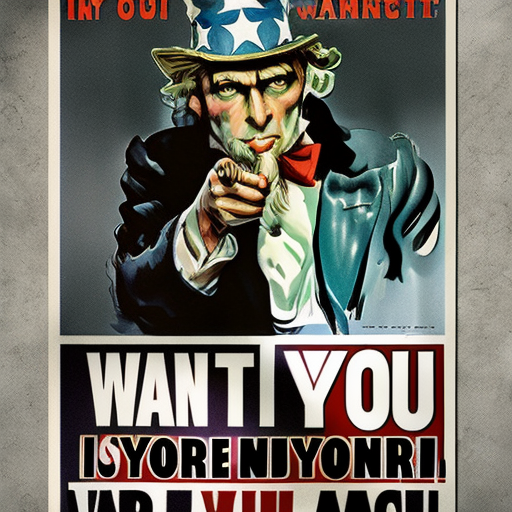
"A parody uncle sam poster with the message "I WANT YOU for SYSDYN", parody poster, digital painting, HQ, 4k", Made with Stable Diffusion

---

# Motivation
## The encroaching critical transition
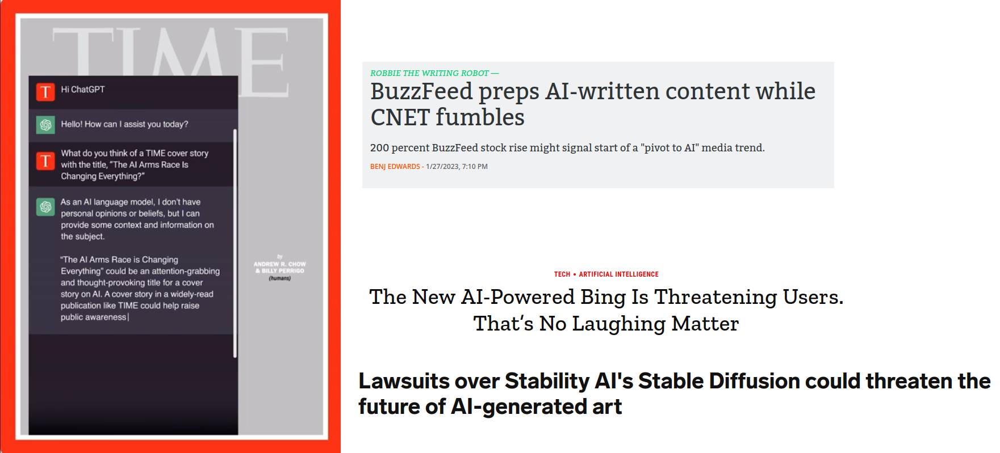
https://arstechnica.com/information-technology/2023/01/pivot-to-chatgpt-buzzfeed-preps-for-ai-written-content-while-cnet-fumbles/

https://www.businessinsider.com/stable-diffusion-lawsuit-getty-images-stablility-ai-art-future-2023-1?op=1&r=US&IR=T

---

https://www.bain.com/vector-digital/partnerships-alliance-ecosystem/openai-alliance/

---

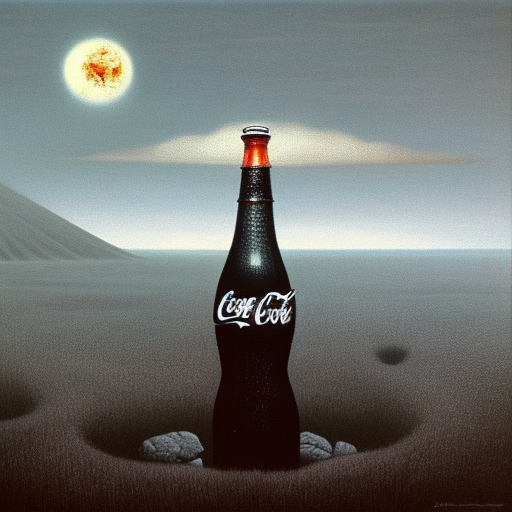
"Man-made horrors beyond your comprehension, Zdzisław Beksiński, The Coca Cola Company, Horror, Matte painting, HQ, 4k", made with Stable Diffusion

---
# Today's Program
0. Basics of Neural Networks
1. Optimization Algorithms
2. Generative Adversarial Networks
3. Recurrent Neural Networks
4. ResNets and Neural ODEs
5. Diffusion Models

---

# What's a Neural Network again?
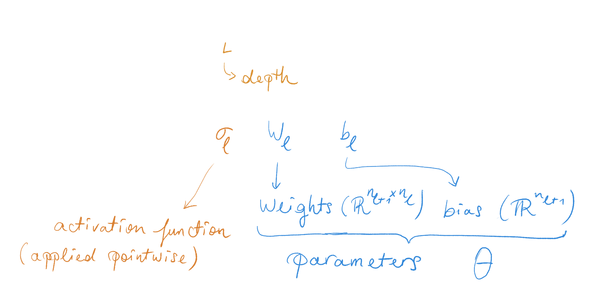

---

# How to train your Neural Net
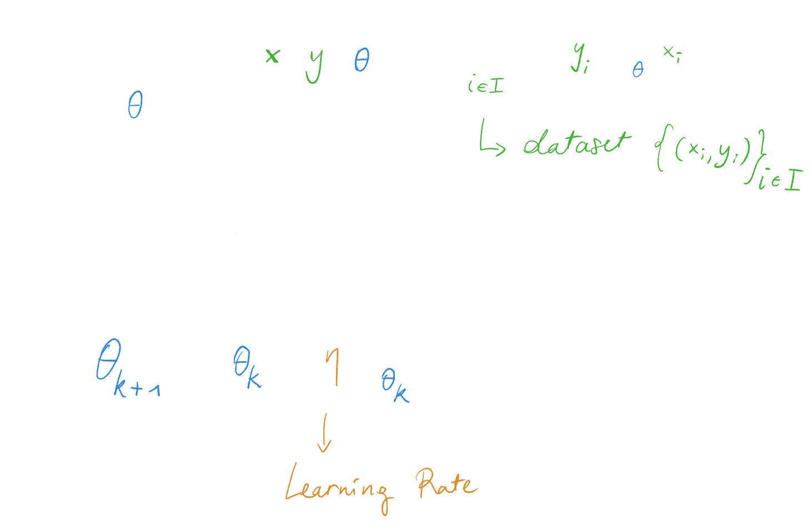

---
# Vignette 1: Optimization Algorithms
## Pitfalls of training NNs
- For large datasets, evaluating the loss gets expensive
- The loss function is often non-convex
- No line search
- Training can take days, or months

---
# Optimization Algorithms
## Stochastic Gradient Descent
Replace the loss gradient by its expectation over the dataset
$$ {\color{#3085d7}\theta_{k+1}} = {\color{#3085d7}\theta_k} - {\color{#d98f2e}\eta} \mathbb{E}_{\color{#3fb12e}i\in I}[\nabla_{\color{#3085d7}\theta_k} L] $$

- **Stochastic** can get out of local minima
- Loss gets evaluated on random samples without replacement
- Still an ODE as $\eta \rightarrow 0$

---
# Optimization Algorithms
## Momentum methods
Add scaled past gradients
$$ v_{k+1} = {\color{#d98f2e}\gamma} v_k + {\color{#d98f2e}\eta} \nabla_{\color{#3085d7}\theta_k} \mathcal{L} $$
$$ {\color{#3085d7}\theta_{k+1}} = {\color{#3085d7}\theta_k} - v_{k+1} $$
- Second order system with gradient as acceleration
- In the ODE limit, this is a Hamiltonian system [1]

[1] J. Diakonikolas, M.I. Jordan, *Generalized Momentum-Based Methods: A Hamiltonian Perspective*, SIAM J. Optim., 31 (1), (2021)

---

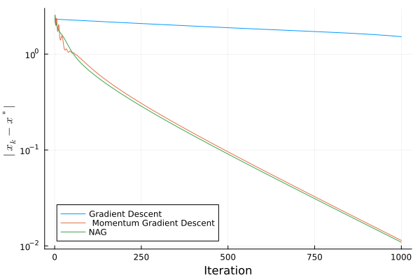 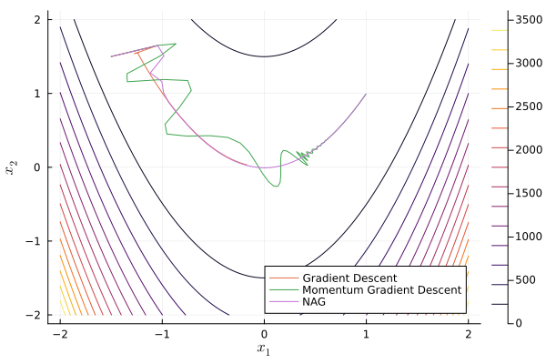

---

# Vignette 2: Generative Adversarial Networks

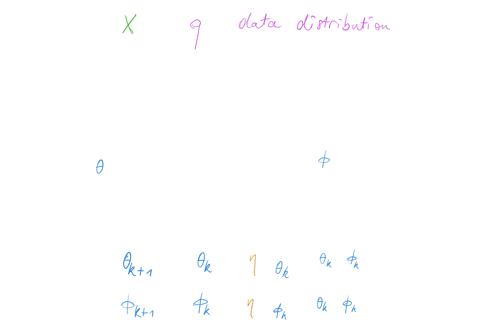

https://www.inference.vc/my-notes-on-the-numerics-of-gans/

---

# Vignette 3: Recurrent Neural Networks

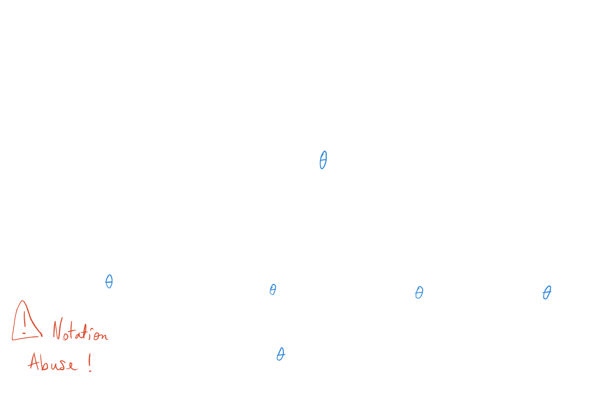

---
# Vignette 4: Residual Networks

$$ x_{\ell+1}  = x_\ell + {\color{#d98f2e}h}  \varphi_\ell (x_\ell) $$

Motivation: force $\varphi_\ell$ to stay "close" to identity
Alternative: Looks like Euler's method! $\rightarrow$ force $\varphi_\ell$ to be "regular"

Idea 1: Higher-order discretizations

---
# Neural ODEs
Idea 2: $h \rightarrow 0$
$$ \dot{x} = \Phi(x,t,{\color{#3085d7}\theta}) $$
**Advantages**
- Can use black-box ODE solvers
- Adaptive time steps $\rightarrow$ Can handle irregularly sampled time series
- Controller design, Physical Modeling, ...
- Fit missing/unknown terms in existing scientific models (Scientific ML)

---

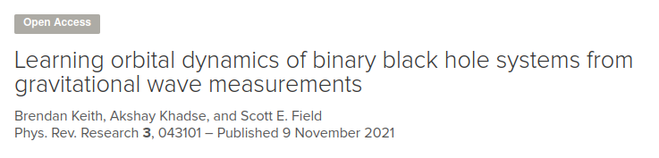

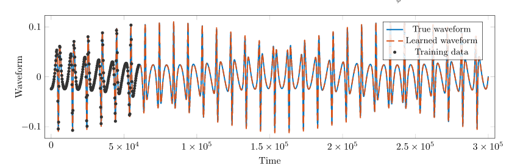

https://phys.org/news/2021-11-machine-derive-black-hole-motion.html

---

# Vignette 5: Diffusion Models

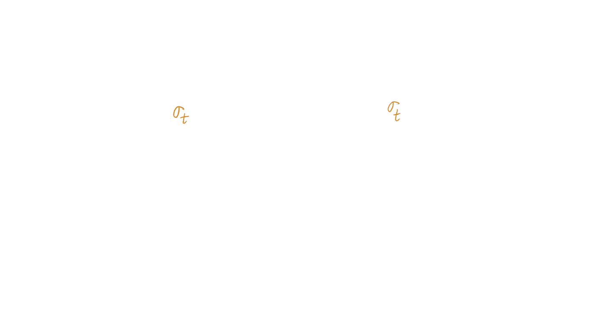

---
# Forward process
Mathematically, the forward process can be expressed as an SDE, e.g.
$$ dy(t) = dW_t $$
$$ y(0) \sim \color{#d056e0}q $$
We can reverse this SDE to obtain another SDE, or an ODE
$$ dy(t) = -\frac{1}{2} \nabla_y \log p_t(y)dt, $$

---

https://yang-song.net/blog/2021/score/#score-based-generative-modeling-with-stochastic-differential-equations-sdes

---
# Score-based Diffusion Models
Approximate the *score* $\nabla_y \log p_t(y)$ by a neural network $s(y,t)$ 

(This is a Neural ODE!)

**Controlled Generation**
Use conditional score 
$$\nabla_y \log p_t(y | x) = \nabla_y \log p_t(y) + \nabla_y \log p_t(x|y)$$

---

# Closing words

   
  

'The Euler-Lagrange Equations, oil painting, trending on artstation, HQ", made with Stable Diffusion

---
# Further Reading

- [P. Kidger, *On Neural Differential Equations*, PhD Thesis (2022)](https://arxiv.org/abs/2202.02435)
- [Rackauckas et al. *Universal Differential Equations for Scientific Machine Learning*, (2020)](https://arxiv.org/abs/2001.04385)
- [P. Kidger - Score based diffusions explained in just one paragraph](https://kidger.site/thoughts/score-based-diffusions-explained-in-just-one-paragraph/)
- [A. Ananthaswamy - The Physics Principle That inspired Modern AI Art - Quanta Magazine](https://www.quantamagazine.org/the-physics-principle-that-inspired-modern-ai-art-20230105/)
- [Cheatsheet: Recurrent Neural Networks](https://stanford.edu/~shervine/teaching/cs-230/cheatsheet-recurrent-neural-networks)